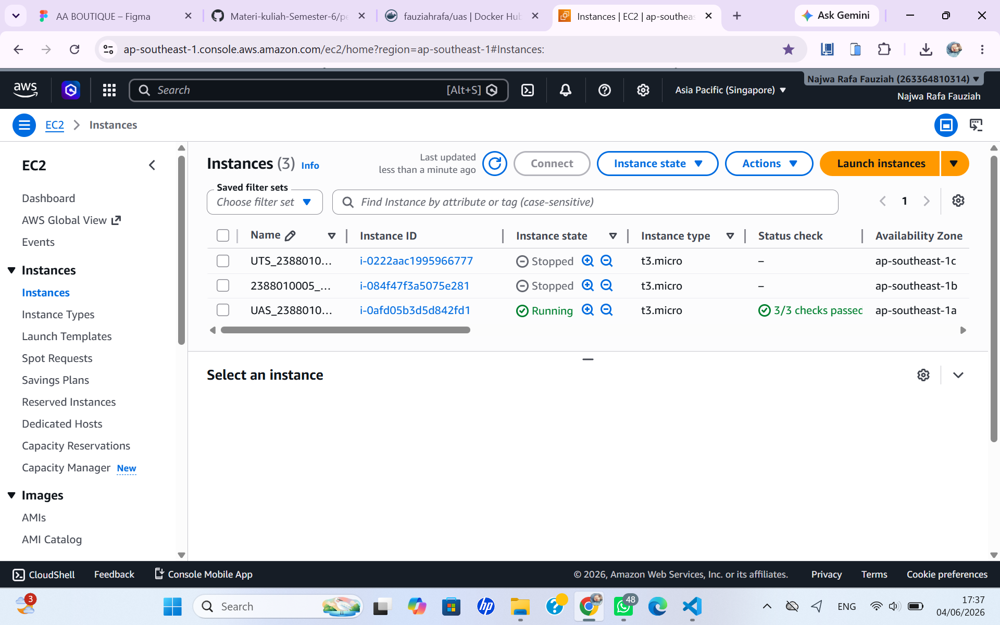
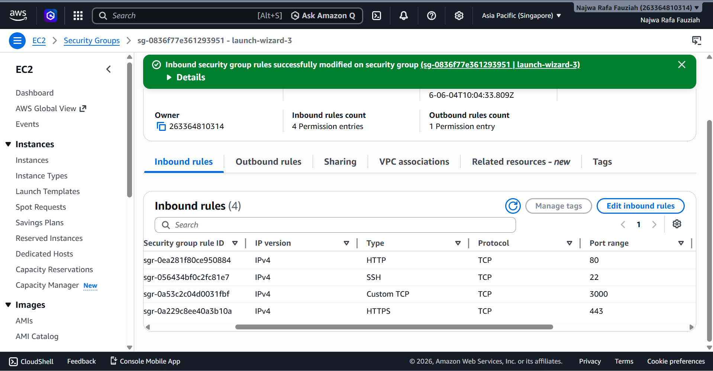
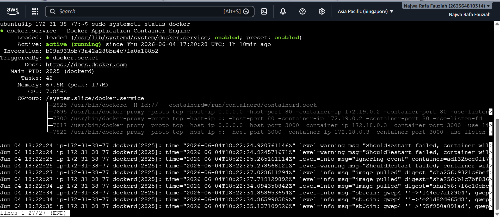
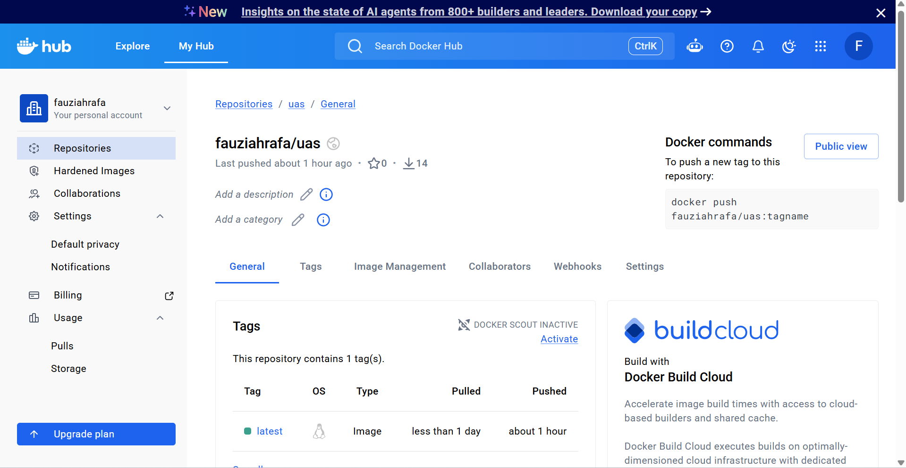
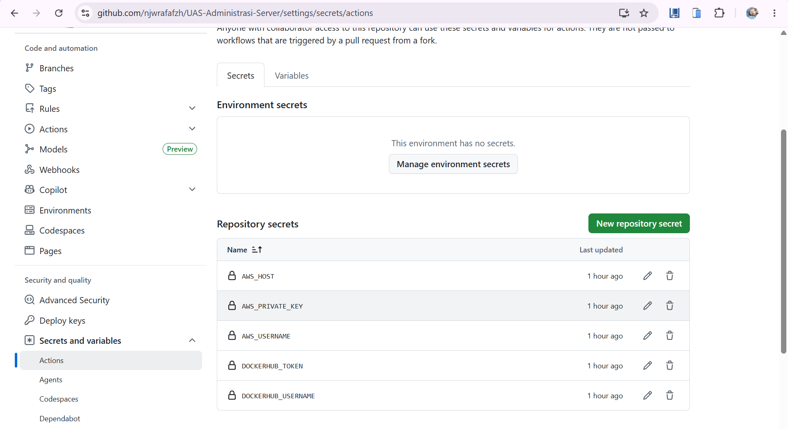
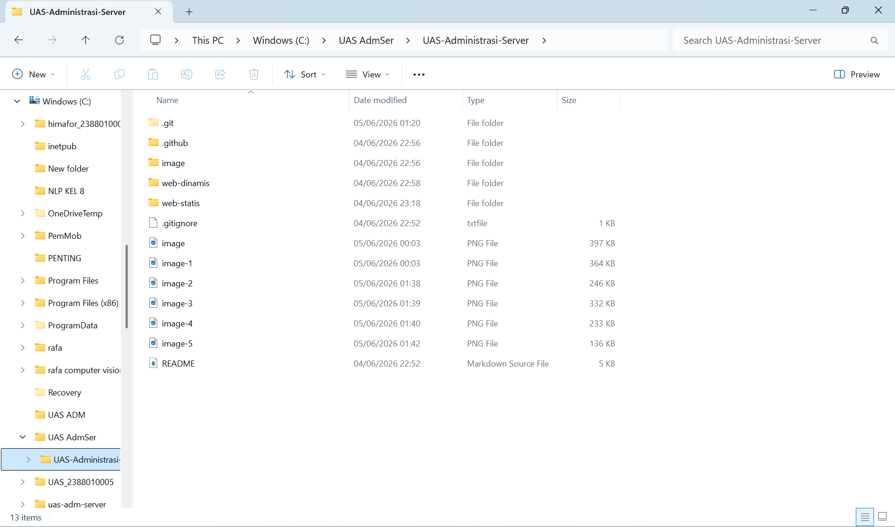
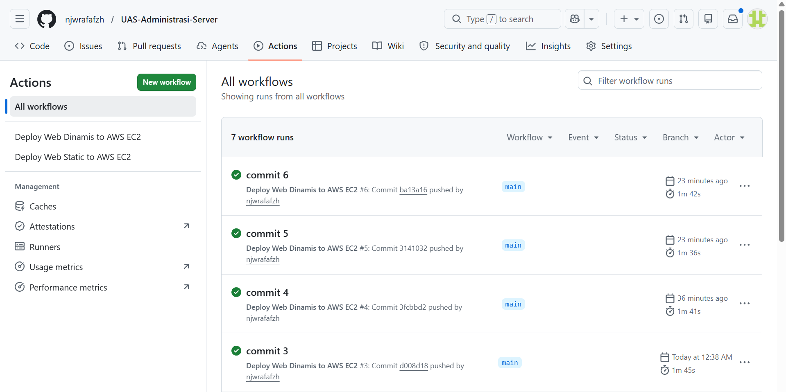
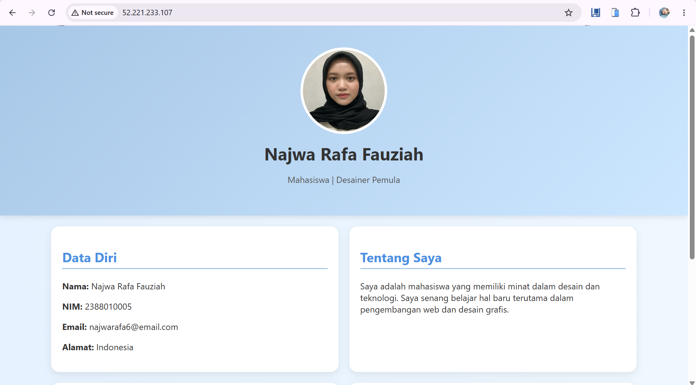
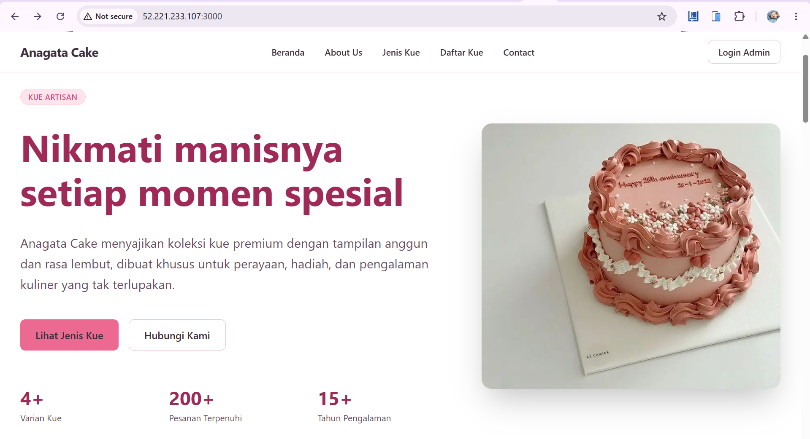
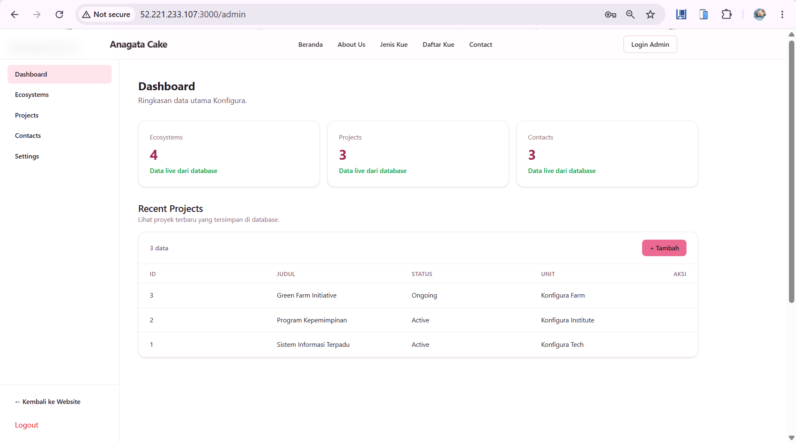

# Laporan UAS: Deployment Aplikasi Web dengan Docker dan GitHub Actions

1. Membuat instance baru
- Menyiapkan dan membuat instance server baru di layanan cloud.
- Menyimpan file key pair `.pem` dengan aman untuk akses SSH.


2. Menyimpan key pair `.pem`

- Mengunduh file kunci privat `.pem` dari platform cloud.
- Menyimpan file ini di lokasi yang aman agar dapat digunakan untuk login server.

3. Menyesuaikan konfigurasi firewall

- Membuka port `80` untuk akses HTTP.
- Membuka port `3000` untuk akses aplikasi web yang berjalan pada port tersebut.


4. Menginstal Docker Engine

- Menghapus paket Docker lama terlebih dahulu.
- Menginstal `docker-ce`, `docker-ce-cli`, `containerd.io`, `docker-buildx-plugin`, dan `docker-compose-plugin`.
- Memverifikasi status layanan Docker agar dapat digunakan untuk deployment.
Perintah yang digunakan:
```bash
sudo apt remove $(dpkg --get-selections docker.io docker-compose docker-compose-v2 docker-doc podman-docker containerd runc | cut -f1)
sudo apt install docker-ce docker-ce-cli containerd.io docker-buildx-plugin docker-compose-plugin
sudo systemctl status docker
```


5. Menyiapkan Docker Hub

- Membuat token akses Docker Hub untuk autentikasi push image.
- Mengatur repository baru di Docker Hub dengan nama `uas`.


6. Mengonfigurasi GitHub Actions

- Membuat secret key di GitHub Actions agar workflow dapat terhubung ke Docker Hub.
- Menambahkan variabel rahasia untuk proses build dan deploy otomatis.


7. Menyalin dan menyesuaikan file deploy

- Menyalin file aplikasi yang akan dideploy ke repository GitHub.
- Menyesuaikan konfigurasi Docker dan deployment sesuai struktur aplikasi.


8. Push dan verifikasi deployment

- Mengirimkan perubahan ke GitHub untuk menjalankan workflow GitHub Actions.
- Memeriksa status deploy dan alamat IP publik aplikasi.


9. Verifikasi tampilan web statis

- Mengecek halaman web statis setelah deploy.


10. Verifikasi tampilan web dinamis

- Mengecek halaman web dinamis yang berjalan di server.


11. Verifikasi halaman admin

- Mengecek halaman admin untuk memastikan akses backend berhasil.


Hasil

- Instance server berhasil dibuat dan key pair `.pem` tersimpan aman.
- Port firewall yang diperlukan (`80`, `3000`) berhasil dibuka.
- Docker Engine berhasil diinstal dan berjalan normal.
- Docker Hub token dibuat dan repository `konfigura_uas` tersedia.
- GitHub Actions berhasil dikonfigurasi dan workflow deploy dijalankan.
- Aplikasi berhasil dideploy dan dapat diakses di lingkungan produksi.
- Verifikasi menunjukkan web statis, web dinamis, dan halaman admin berfungsi.
